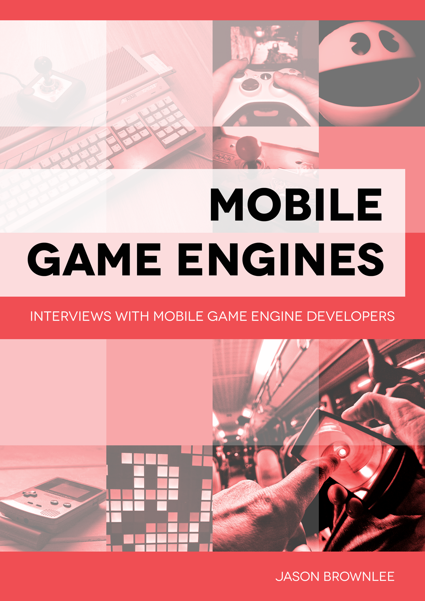

# Mobile Game Engines

This is an archive of books and material for the **Mobile Game Engines** project, circa 2012-2013.

## About

This project started off as a list of all game engines intended for developing games for IOS, Android and HTML5.

It was turned into a website that listed all game engines hosed at `MobileGameEngines.com`. The website was developed using ruby on rails and was hosted on heroku.

Developers of game engines and developers of games using the game engines were interviewed, resulting in the publication of two books.

## Website

The website was hosted at:

* [MobileGameEngines.com](https://web.archive.org/web/20140203020740/http://mobilegameengines.com/) (archived)

The code and database for the website was not archived.

**Screenshot:**

## Books

Two books were published as part of the project. The books were available in kindle and paperback format and were available from most online retailers, including `amazon.com`.

Paperbacks were distributed via `lulu.com`. Kindle versions distributed via `amazon.com`. Wider distribution was managed via `smashwords.com`.

Not all formats of all books were archived.

### Interviews With Game Developers

**Title:** Mobile Game Engines: Interviews with Mobile Game Developers

**Blurb:** This book contains a total of 38 must-read interviews on the making of mobile games using 15 modern game engines. In this book you'll hear how hired guns and indie game developers alike build games and get them to market using off-the-shelf mobile game engines. There is no abstracting or watering down of their experiences. You will read about what they did, in their own words. The interviews were designed to collect wisdom from game developers around the problems of choosing and working with off-the-shelf mobile game engines, and you will agree that this objective was far exceeded. You will get a snapshot into the thoughts and processes from a diverse and successful collection of mobile game developers from around the world. You will feel recharged and will be reinvigorated in your own game development efforts. The sage advice in these interviews will be useful in navigating, selecting and working with the tidal wave of promising mobile game engines available. Reading these interviews will help you find and best use the perfect engine for your mobile game and get it into the hands of an audience that loves it just as much as you.

**Downloads:**

Jason Brownlee, __Mobile Game Engines: Interviews with Mobile Game Developers__, Self Published, July 2012.

* [epub](books/mobile-game-engines-interviews-with-mobile-game-developers.epub)
* [mobi](books/mobile-game-engines-interviews-with-mobile-game-developers.mobi)
* [pdf](books/mobile-game-engines-interviews-with-mobile-game-developers.pdf)

### Interviews With Game Engine Developers

**Title:** Mobile Game Engines: Interviews with Mobile Game Engine Developers

**Blurb:** This book contains a total of 22 exclusive interviews on the making of start-of-the-art mobile game engines for Apple and Android devices as well as the web. In this book you'll gain direct first-hand knowledge of how the mobile developer elite design, develop and deliver modern game engines while keeping abreast of the latest features offered by mobile devices. There is no abstracting or watering down of their experiences. You will read about what do, in their own words. The interviews were designed to collect wisdom from game engine developers around the problems of working with and maintaining off-the-shelf mobile game engines, and you will agree that this objective was far exceeded. You will get a snapshot into the thoughts and processes from a diverse and successful collection of mobile game engine developers from around the world. You will feel recharged and will be reinvigorated in your own game development efforts. The sage advice in these interviews will be useful in navigating, selecting and working with the tidal wave of promising mobile game engines available. Reading these interviews will help you find and best use the perfect engine for your mobile game and get it into the hands of an audience that loves it just as much as you.

**Downloads:**

Jason Brownlee, __Mobile Game Engines: Interviews with Mobile Game Engine Developers__, Self Published, January 2013.

* [epub](books/mobile-game-engines-interviews-with-mobile-game-engine-developers.epub)
* [mobi](books/mobile-game-engines-interviews-with-mobile-game-engine-developers.mobi)

## Sources

* [mobilegameengines.com](https://web.archive.org/web/20140203020740/http://mobilegameengines.com/) (archived)
* [Mobile Game Engines: Interviews with Mobile Game Engine Developers](https://www.goodreads.com/book/show/19187970-mobile-game-engines) (goodreads)
* [Mobile Game Engines: Interviews with Mobile Game Developers](https://www.goodreads.com/book/show/21084991-mobile-game-engines) (goodreads)

